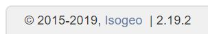

# Isogeo Manager {#homepage}

Isogeo Manager appelée aussi "Manage" est une application interne qui permet d'effectuer des opérations dans la base de donnée d'Isogeo via l'API.

Le manager permet de gérer principalement :

* Les [mots-clés](/keywords/keywords.md) de la base centralisée ;
* Les [applications](/applications/list.md) autorisées à dialoguer avec l'API ;
* Les [groupes de travail](/groups/list.md) de la plateforme.

Seuls les utilisateurs de type *Staff* ont accès à l'application. Ils doivent s'authentifier via la fenêtre d'authentification ci-dessous.

## Global {#global}

Vision :

* **Pour** les gestionnaires de comptes Isogeo (équipe projet, équipe commerciale)
* **Qui** veulent administrer les groupes de travail et les utilisateurs de la plateforme Isogeo
* **Est** une application qui permet de gérer les comptes de la plateforme Isogeo : création, renommage ou suppression de groupes de travail, invitation d’utilisateurs... Elle permet l’activation ou la désactivation dynamique d’options gratuites ou payantes pour les groupes de travail.

*Isogeo.Manager* n’est pas un CRM et ne sert entre autres pas à gérer l’expiration commerciale ou le renouvellement des options achetées (ou non) par les clients d’Isogeo.

## Déploiement {#deployments}

En mode *SaaS*, l'application est déployée sur des Web App Azure :

* QA : <https://qa-isogeo-manage.azurewebsites.net/>
* PROD : <https://manage.isogeo.com/>

En mode *on-premises*, l'application peut être déployée :

* sur un serveur avec NodeJS installé
* via Docker

## Version {#versions}

La version de l'application est indiquée en bas à droite de la page ou à l'adresse https://manage.isogeo.com/about.

